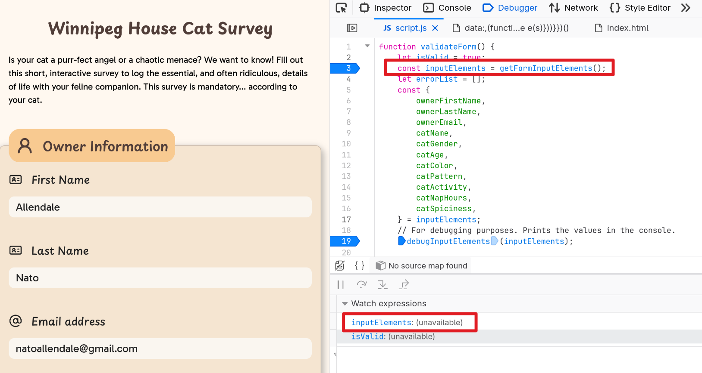
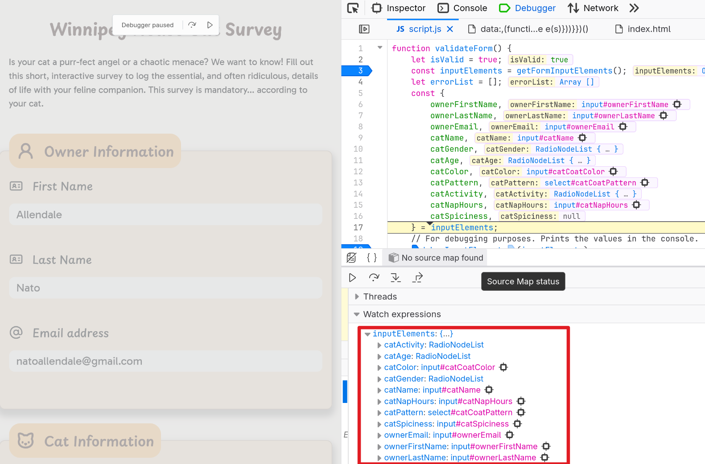
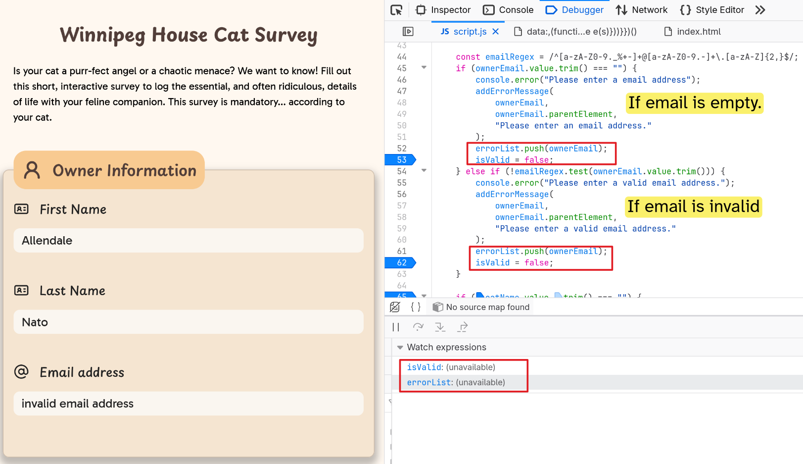
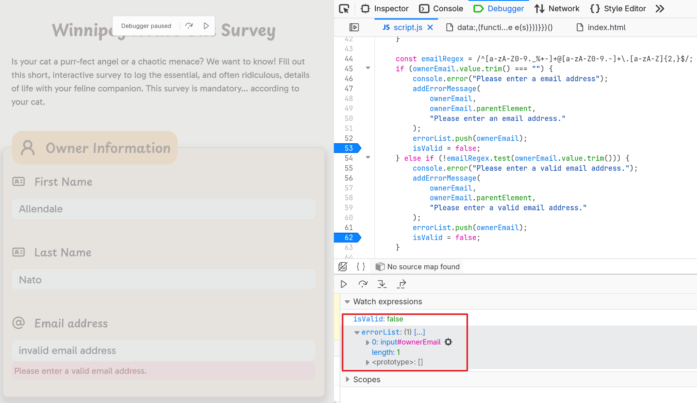
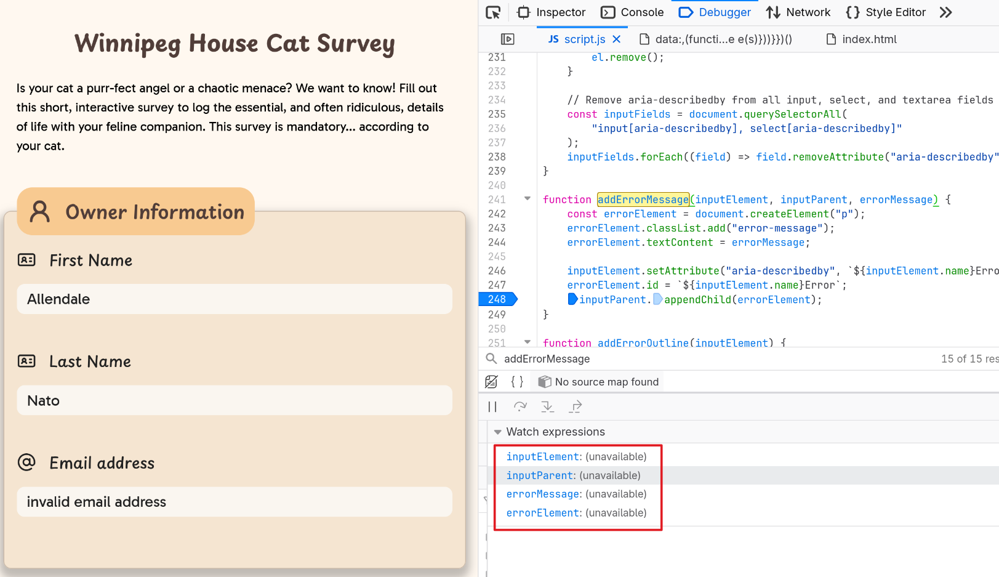
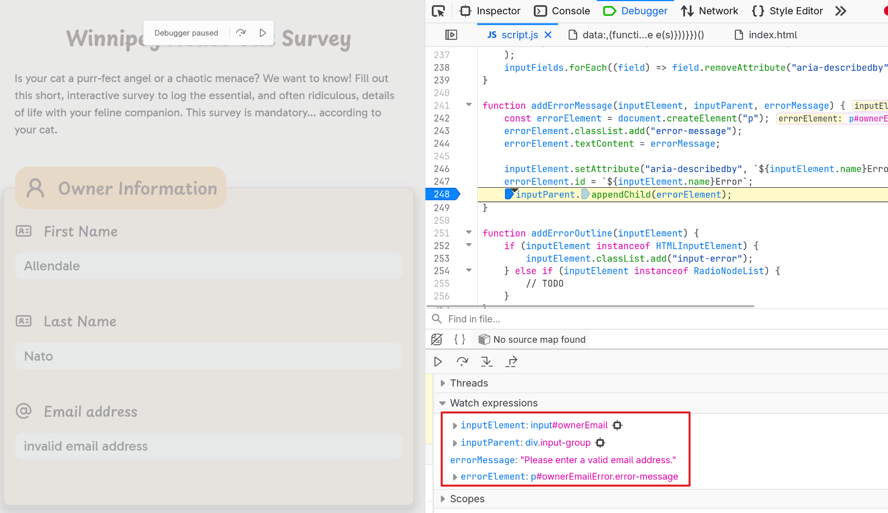

# Debugging Analysis

Critical Breakpoints:

- `validateForm()`'s input field capture
- `validateForm()`'s validation
- `addErrorMessage()` error display

## Capturing the input fields' data

Before validating the input fields, I first need to retrieve the data supplied by the user. In `validateForm()` I defined `inputElements` that will hold all of the form's input elements.

To fetch all of the input elements, I created a helper function called `getFormInputElements()` which returns an object where the keys are mapped to the input element's `name` attribute.

**Breakpoint Analysis #1: `validateForm()`'s input field capture**

The 1st breakpoint screenshot shows `inputElements` having no values under the "Watch expressions" panel. This is because at this moment, the user hasn't submitted the form yet.

**Breakpoint Analysis #2: `validateForm()`'s input field capture**

After submitting the form and stepping over the breakpoint, we can see that `inputElements` now contains an object of all of the form's input fields.

The values of `inputElements` are then destructured to their input name's for ease of access.

## Validating the input fields

Right after `validateForm()` has fetched all the input elements, it will immediately validate each input fields. Before validation, I declared a variable called `isValid` which is set to `true`. If set to `false`, it means that there's an invalid field which results to the form not being submitted.

In addition, I also declared `errorList` variable which is an array of invalid input elements. This is initially an empty array that will be populated if there are one or more invalid inputs.

**Breakpoint Analysis #3: `validateForm()`'s input validation**

At this part of `validateForm()`, we are validating whether the supplied email address is not empty and valid. Under the watched expressions, both `isValid` and `errorList` have not value because the user hasn't submitted the form yet. In this example, the user has supplied invalid email value.

**Breakpoint Analysis #4: `validateForm()`'s input validation**

After submitting the form with an invalid email and stepping through the breakpoint, we can see that `isValid` is set to `false` and `errorList` now contains the invalid input element.

## Adding error messages

I created a separate function that handles error message creation. The function is called `addErrorMessage()`, and this is called by `validateForm()` whenever it detects an invalid input field.

`addErrorMessage()` has three parameters: the input element, the input element's parent, and the error message to display.

The error message is not added inside the input element, but as a new element of the input element's parent (basically a sibling).

**Breakpoint Analysis #5: `addErrorMessage()` error message creation**

Like in the previous analysis, the variables in the watched expressions are empty because the user hasn't submitted their form yet. The submitted form will have an invalid email value.

**Breakpoint Analysis #6 `addErrorMessage()` error message creation**

This breakpoint screenshot shows `errorElement` being created as a `p` element containing the `errorMessage` as its text content.

`errorElement` will then be appended to the `inputParent`.
